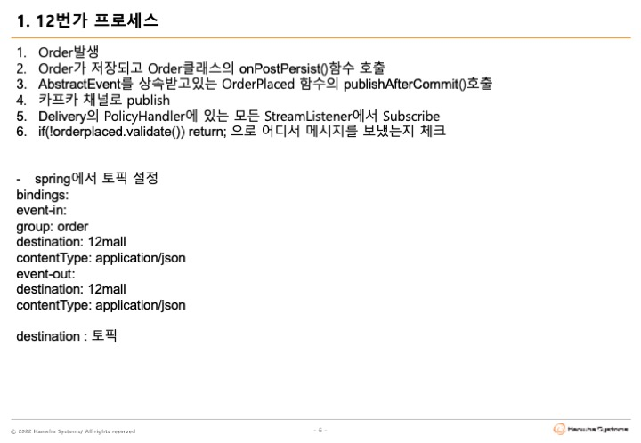
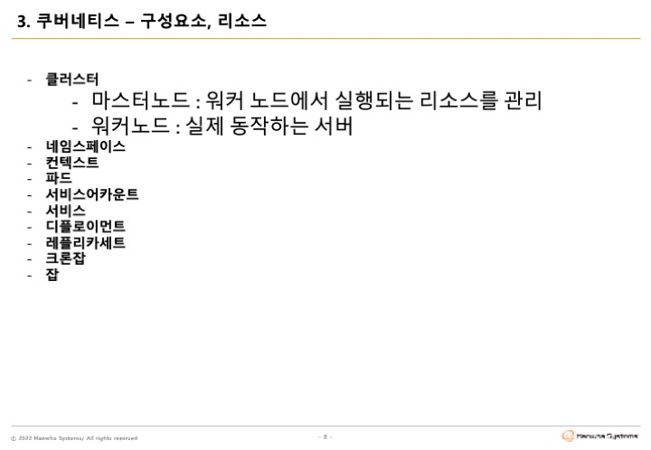

# msa-capstone-project

## 📢 About
* 지원
  - 네트워크운영팀 / 윤정호 대리
  - Digital Native TF / 정현영 사원
* Platform
  - ZOOM
    + URL : https://us06web.zoom.us/j/5327375996?pwd=dWI4WFRQZGhsajJQaGRkRGFqc09Wdz09
    + 회의 ID : 532 737 5996
    + 암호 : 1234

  - Kakao
    + URL : https://open.kakao.com/o/gSWutree

## 🕙 Schedule
* 일자별 진행

    |일자|진행|내용|
    |:------:|:---|:---|
    |07/25 AM|OJT|과정설명 과제수행환경설명|
    |07/25 PM|Brain Storming|msaez.io|
    |07/26 ALL|Team Project|팀별과제 수행|
    |07/27 AM|Team Project|팀별과제 수행|
    |07/27 PM|Wrap Up|과제 제출 시작:14시 마감:16시|

* 시간별 진행
  - 09:00 ~ 11:30 오전과정
  - 11:30 ~ 13:00 점심시간
  - 13:00 ~ 17:00 오후과정
  
    > NOTE
  
      + 팀별과제 수행중에는 오전/오후과정 중 자율적으로 휴식
      + 3일차 과제제출시에는 준비된 팀부터 팀별 소그룹에서 발표 진행(마감시간 준수)
      + 과제 제출 : jhy156456@hanwha.com(정현영 사원), MD파일의 경우 별도 제출 필요 없음
  
  
## 👫 Team

|팀|성명|직급|소속|
|:----:|:------:|:------:|:------|
|1|🎖 김재현|대리|SharedService2팀|
||   육근일|사원|방산운영1팀|
||   이장행|대리|디지털에셋그룹|
||   장우진|대리|디지털에셋그룹|
|2|🎖 김은정|대리|DigitalNativeTF|
||   김석민|과장|금융운영팀|
||   윤진선|대리|유화운영2팀|
||   이상원|사원|디지털에셋그룹|
|3|🎖 조성국|대리|DigitalNativeTF|
||   김대우|대리|방산운영2팀|
||   김정민|사원|클라우드사업팀|
||   최동규|과장|금융운영팀|
|4|🎖 김은종|대리|디지털워크그룹|
||   윤영진|대리|디지털에셋그룹|
||   천진우|대리|금융운영팀|
||   최수빈|사원|빅데이터팀|
|5|🎖 조영욱|대리|서비스운영1팀|
||   이예찬|대리|SharedService3팀|
||   한정재|사원|SharedService2팀|

## 🤷🏻‍♂️🤷🏻‍♀️ Curriculum

## ✏️ Evaluation

  * 분석설계
  * SAGA Pattern
  * CQRS Pattern
  * Correlation / Compensation(Unique Key)
  * Request / Response (Feign Client / Sync.Async)
  * Gateway
  * Deploy / Pipeline
  * Circuit Breaker
  * Autoscale(HPA)
  * Self-Healing(Liveness Probe)
  * Zero-Downtime Deploy(Readiness Probe)
  * Config Map / Persistence Volume
  * Polyglot

    > NOTE
      + 구현방법 및 산출물 양식은 제한 없이 자유롭게 진행
      + 문항별 담당자명 표시

## 📑 To-Do

* <a href="https://www.msaez.io/#/" target="_blank">Brain Storming</a>
  
  + 팀별로 주제 선정 및 이벤트 스토밍 진행
* GitHub : [https://github.com/jhy156456/hw4-msa-capstone-project]
* <a href="https://gitpod.io/#/https://github.com/wonslog/hw3-msa-capstone-project" target="_blank">GitPod</a>
  + Github 계정 및 Repositoy(public) 준비 ( **for FORK** )
  + gitpod.io/#/{Github-Repository-URL}
  + Collaboration & Sharing
      - 팀장 : github.com > repository > Settings > Collaborators > Add People ; 팀원초대
      - 팀장 / 팀원 : gitpod.io > Settings > Integrations > GitHub > Edit Permissions > Public_repo Check ;  GitPod - GitHub 권한설정
  - gitpod 초기 연동시 필요한 라이브러리들이 없는 상태이며 **.gitpod.yml** 파일에 선언한 명령어들 자동 실행됨
  - 실행 안되는 명령어들이 있으면 직접 설치
* <a href="https://794003312682.signin.aws.amazon.com/console">AWS</a> (*약 15~20분 소요*)
  + 계정정보(IAM)메일 발송
  + Region-Code : 메일 내 Region 
  + Cluster-Name : Account-Id
  + Image-Repository-Name : Account-Id

> 참고

  이전실습환경(https://labs.msaez.io/)에 접속해서 실습내용을 확인해 볼 수 있으나, `INTO THE LAB`에서 실습했었던 온라인상의 실행은 불가하므로, `파일다운로드`버튼을 이용해 실습했던 code를 다운로드 해서 확인

## 🧨 Attention

### GitPod

* `Github 계정 1개` 기준으로 `약 50개`까지의 Pod를 각각 `약 24시간`까지 유지하므로 진행시 유의 
* 장기간 자리비움시 작업중인 내용이 유실될 있으니 `저장` 또는 `commit(push)`
* 과제수행 중 문의사항있을 경우, 카카오톡 오픈채팅창 이용

## 👍 Good Practice
  * 배달의 민족 Cover : [https://github.com/msa-ez/example-food-delivery]
  * Air BnB Cover : [https://github.com/msa-ez/airbnb_project]

## 🪶 Lite Version (for FORK )

  * Dragon Water Lite 🦖💧 : [https://github.com/yongdoohar/msa-capstone-project]

## Thanks

  * 미래혁신센터 / Cloud Native개발팀
  * 양기훈 과장, 변용수 대리

## 주요개념
</img>
</img>
</img>
</img>
</img>
</img>
</img>